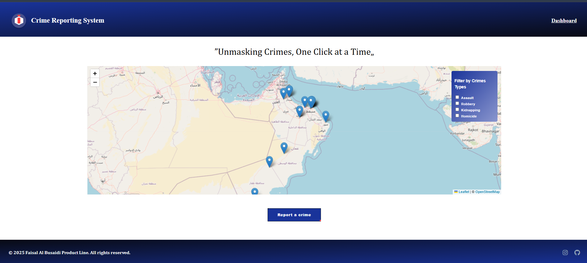

# Crime Reporting System  

**"Unmasking Crimes, One Click at a Time"**  

  
  

## Overview  
A web-based crime reporting system that allows citizens to submit and visualize crime incidents across Oman with geographic validation.

## Features  
- Interactive map visualization (Leaflet.js)  
- Oman-specific coordinate validation (Lat: 16.6-26.4, Long: 52.0-59.8)  
- Persistent local storage for reports  
- Crime type categorization & filtering  

## Quick Start  

### Prerequisites  
- Web browser (Chrome/Firefox recommended)  
- VS Code with Live Server extension (or any local server)  

### Installation  
```bash
git clone https://github.com/Faisal-Abdo/Crime_reporting_system.git
cd crime-reporting-system
```
### Running the Project
1.Open project in VS Code
2.Right-click index.html → "Open with Live Server"
3.System will launch in default browser
